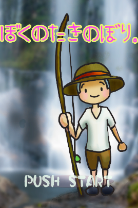

bokunotakinobori
================

麦わらの少年が滝を登る、アクションゲーム

ゲーム画面
--------------------

遊び方
--------------------

画面をスライドすると、キャラクターが移動します。
上から落ちてくる丸太をよけて頂上目指します。

ダウンロード
--------------------

- [WEBで遊ぶ](http://tsurutatomoya.github.io/bokunotakinobori/)
- [Android用apkをダンロード](https://github.com/tsurutatomoya/bokunotakinobori/releases)

開発環境
--------------------
- Unity 4
